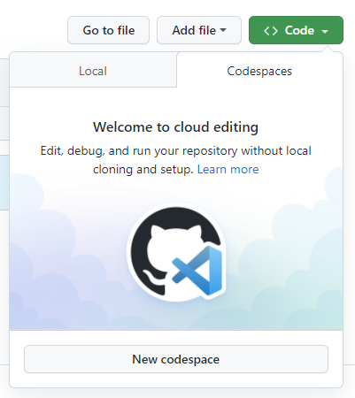
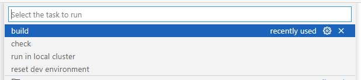
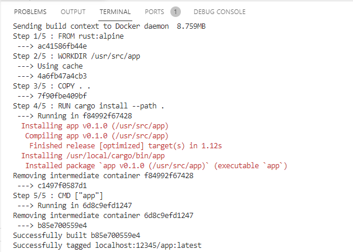
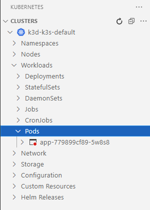
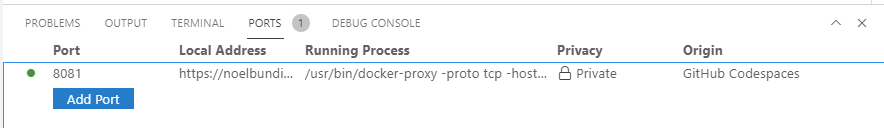
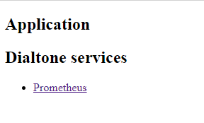

# Rust App Seed

This is an application seed to quickly get started with a containerized Rust application

## Features

Rust inner loop

* `Ctrl+Shift+B` executes `cargo build`
* Launch configurations (`F5` debugging):
  * Debug executable
  * Debug unit tests
* Tasks
  * `cargo check`
  * `cargo build`
* Extensions
  * [CodeLLDB](https://marketplace.visualstudio.com/items?itemName=vadimcn.vscode-lldb)
  * [rust-analyzer](https://marketplace.visualstudio.com/items?itemName=matklad.rust-analyzer)

Container inner loop

* Tasks
  * `run in local cluster` - launches your app in a local `k3d` cluster
  * `reset dev environment` - reset the local `k3d` cluster
* Platform services
  * Port `8081` exposes the dialtone services (Prometheus, ex) available to your app

## Getting Started

[Use this template](https://github.com/noelbundick-msft/hack-mcp-dx/generate) to create a new repository

In your repository, create a new Codespace

Make code changes, using the preconfigured tasks to check, build, and debug your app

When you are ready to run your app in a container, use the `run in local cluster` task

(Advanced) View and debug in your local cluster via the `kubernetes` extension and/or `kubectl`

Visit the `Ports` tab to get the address for your codespace for port `8081`

Hit the site to get a list of application endpoints and dialtone services

